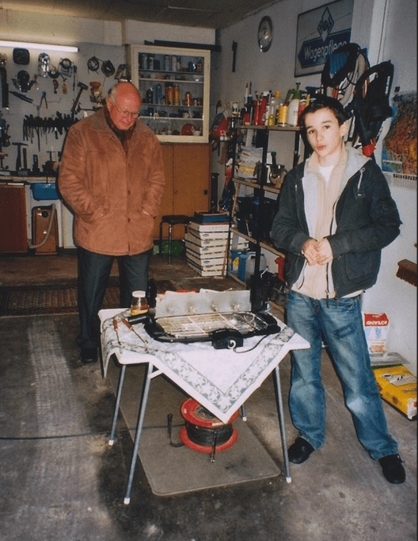
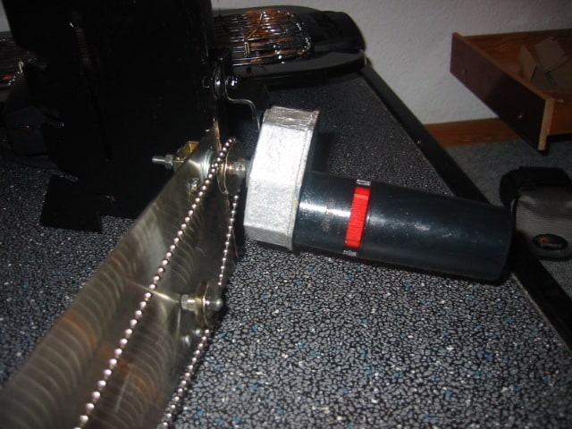
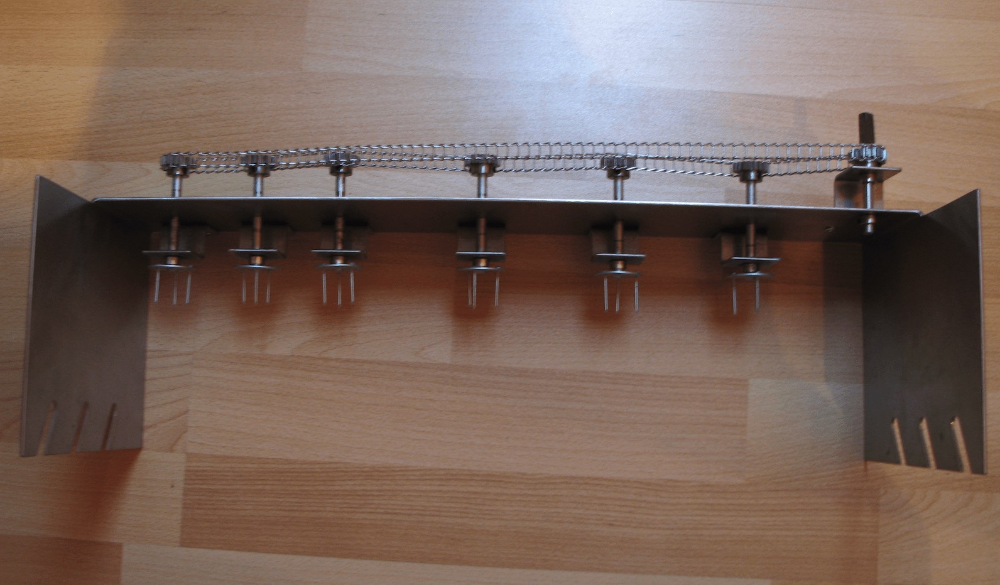

# Self-Grilling-Barbecue

This project from 2007 describes a mobile attachment for grills that automatically turns sausages. The motivation for the idea was simply that I did not like to stand at the grill. In addition, during the soccer world championship, everyone was always gathered in front of the TV, while someone had to take care of the sausages. So the idea of a self-grilling barbecue was born.

The sausages are put on plug systems of the grill attachment and continuously rotated. A useful side effect of the continuous rotation was the even browning and changing heat input direction. This prevented the sausage from burning even after long periods on the grill.

With this project, I won the regional competition of Jugend Forscht in 2007 and took second place in the state competition. My grandfather supported me in building the grill, which made the project a great grandfather-grandson project. Looking back, I am very grateful for the time we were able to spend together.

## First Prototype

The drive of the first prototype was realized via the chain of the bathtub plug and thus probably not quite ready for the market 😉

## Second Prototype

The second prototype was improved accordingly with gears and a chain.

## Conclusion

The project certainly increased my fascination for technology, gave me my first insights into manufacturing processes, and created an understanding of how to develop a product that would ultimately be accepted by the market. The "Jugend Forscht" organizarion also sponsored an application for a [utility model](https://depatisnet.dpma.de/DepatisNet/depatisnet?window=1&space=menu&content=treffer&action=bibdat&docid=DE102007009595A1), which also gave me first insights into the patent system.

In addition, I was able to spend valuable time with my grandfather, during which I learned many skills from him.
